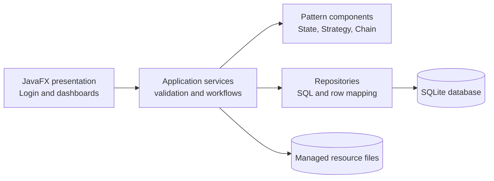
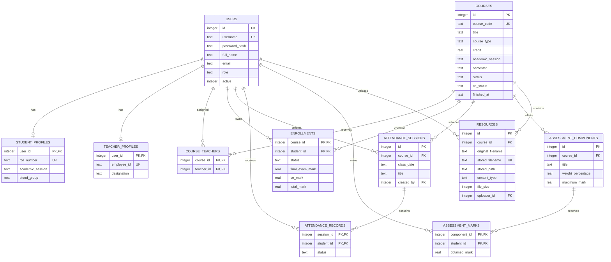
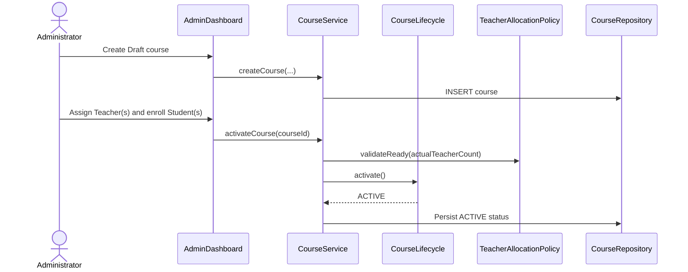
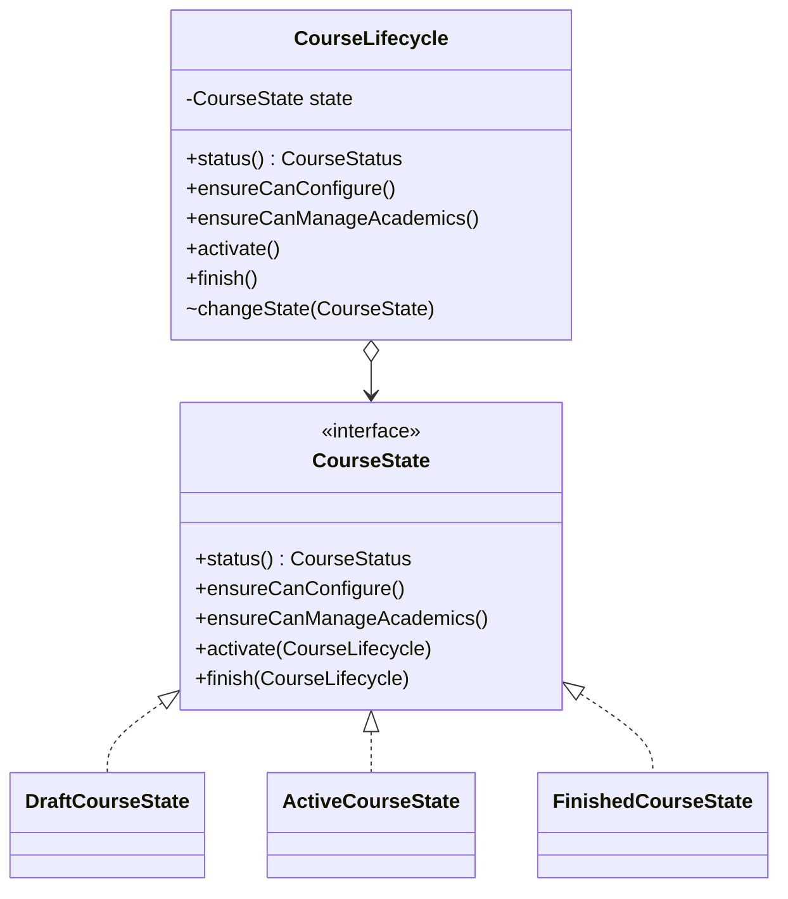
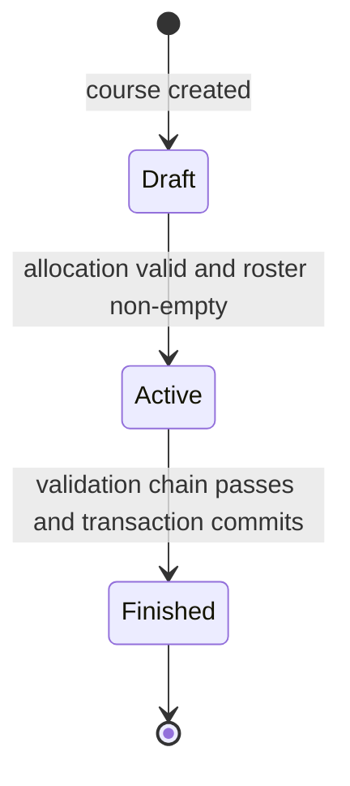
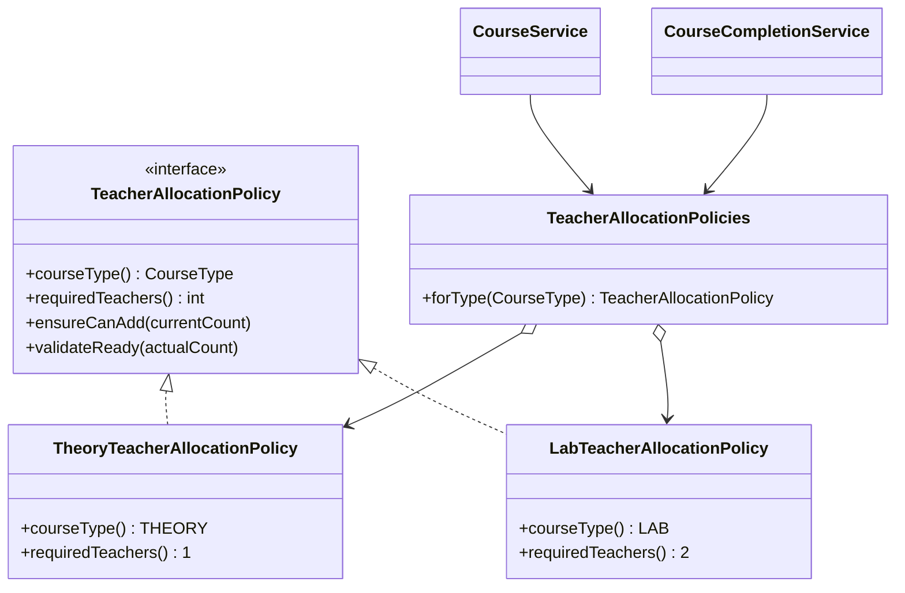
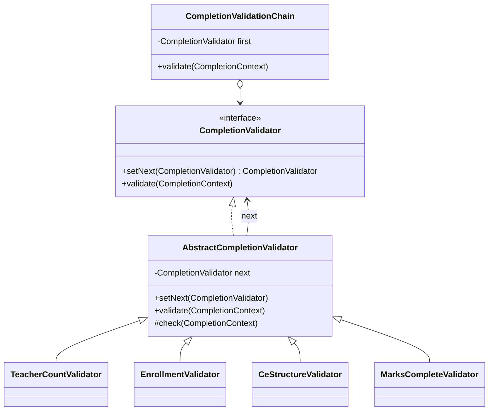
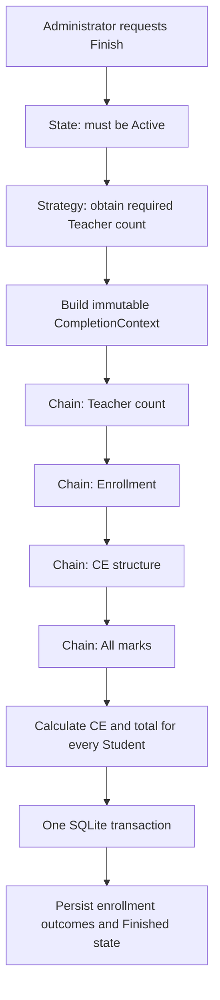

# IIT Course Management System

A minimalist JavaFX desktop application for managing the academic lifecycle of IIT courses—from Draft configuration through attendance and Continuous Evaluation (CE) to final results and a read-only Finished state.

This repository contains a reference implementation of the IIT Course Management System. It deliberately concentrates on one coherent workflow rather than unrelated departmental features. Teacher ratings, anonymous reporting, alumni records, messaging, and student uploads are outside the current scope.

## Contents

- [Project objective](#project-objective)
- [Implemented scope](#implemented-scope)
- [Technology and prerequisites](#technology-and-prerequisites)
- [Quick start](#quick-start)
- [Demo data](#demo-data)
- [Architecture](#architecture)
- [Database design](#database-design)
- [Business workflows and rules](#business-workflows-and-rules)
- [Design-pattern categories](#design-pattern-categories)
- [Pattern 1: State](#pattern-1-state)
- [Pattern 2: Strategy](#pattern-2-strategy)
- [Pattern 3: Chain of Responsibility](#pattern-3-chain-of-responsibility)
- [How the patterns cooperate](#how-the-patterns-cooperate)
- [Patterns intentionally not used](#patterns-intentionally-not-used)
- [Validation, security, and consistency](#validation-security-and-consistency)
- [Testing](#testing)
- [Requirements traceability](#requirements-traceability)
- [Contribution workflow](#contribution-workflow)
- [Demonstration workflow](#demonstration-workflow)
- [Current limitations and future work](#current-limitations-and-future-work)

## Project objective

The system serves three roles:

- **Administrator:** creates and maintains accounts, configures courses, allocates Teachers and Students, activates courses, enters 60-mark final-exam results, finishes courses, and views result sheets.
- **Teacher:** works only with assigned courses, records attendance, configures and finalizes CE, enters assessment marks, uploads resources, and views Student summaries.
- **Student:** views only their own courses, attendance, CE, final results, and course resources.

The central design problem is that valid operations change throughout a course's lifetime and several rules must be satisfied together. The implementation therefore uses three meaningful behavioral design patterns:

1. **State** controls what can happen in Draft, Active, and Finished courses.
2. **Strategy** supplies the Teacher-allocation rule for Theory and Lab courses.
3. **Chain of Responsibility** validates every prerequisite before course completion.

The refined functional requirements are documented in [01 - Refined User Story.md](01%20-%20Refined%20User%20Story.md).

## Implemented scope

### Role capabilities

| Capability | Administrator | Teacher | Student |
|---|:---:|:---:|:---:|
| Role-based login | Yes | Yes | Yes |
| Create Student/Teacher accounts | Yes | No | No |
| Search users | Yes | No | No |
| Activate/deactivate accounts | Yes | No | No |
| Create, view, edit, and delete Draft courses | Yes | No | No |
| Assign/unassign Teachers in Draft | Yes | No | No |
| Enroll/remove Students in Draft | Yes | No | No |
| Activate a ready course | Yes | No | No |
| Create attendance sessions | No | Assigned Active course | View own |
| Add/update/delete CE components | No | Assigned Active course | View own |
| Finalize CE and save marks | No | Assigned Active course | View own |
| Upload managed resources | No | Assigned Active course | View/open |
| Enter final-exam marks | Active course | No | View own |
| Validate and finish course | Yes | No | View outcome |
| Course result sheet | Yes | Assigned-course summary | Own summary |

### Major UI screens

1. **Login screen** with account-state validation and role routing.
2. **Administrator dashboard** with Users, Courses and Allocation, and Final Results tabs.
3. **Teacher dashboard** with Overview, Attendance, Continuous Evaluation, and Resources tabs.
4. **Student dashboard** with Overview, Attendance, Continuous Evaluation, and Resources tabs.

These are four major screens with focused tabs rather than a large collection of disconnected windows.

## Technology and prerequisites

| Component | Version in `pom.xml` | Purpose |
|---|---:|---|
| Java | 21 | Language and runtime |
| JavaFX Controls | 21 | Desktop user interface |
| Maven | 3.9+ recommended | Build and dependency management |
| Xerial SQLite JDBC | 3.53.4.0 | SQLite access through JDBC |
| SQLite | Embedded | Persistent local database |
| JUnit Jupiter | 5.12.2 | Unit and integration tests |

Install a JDK 21 distribution and Maven, then confirm:

```powershell
java -version
mvn -version
```

No separate SQLite installation is required. Maven downloads the JDBC driver and JavaFX modules declared in `pom.xml`.

Useful upstream references:

- [OpenJFX Maven documentation](https://openjfx.io/openjfx-docs/#maven)
- [Maven standard directory layout](https://maven.apache.org/guides/introduction/introduction-to-the-standard-directory-layout.html)
- [Xerial SQLite JDBC](https://github.com/xerial/sqlite-jdbc)
- [SQLite foreign-key documentation](https://www.sqlite.org/foreignkeys.html)

## Quick start

Clone the repository, or open a local checkout in a terminal:

```powershell
git clone <repository-url>
cd IIT-Management-System
```

If the repository is already cloned, replace the commands above with `cd path\to\IIT-Management-System`.

Run all tests:

```powershell
mvn clean test
```

Start the JavaFX application:

```powershell
mvn javafx:run
```

Build without launching the UI:

```powershell
mvn clean package
```

### Runtime data

On first start, the application creates:

```text
data/
├── iit-course-management.db   # SQLite database
└── resources/                 # Managed copies of uploaded files
```

The schema is applied idempotently on startup. Seed data is inserted only if the `users` table is empty, so restarting the program does not duplicate records or erase changes.

To begin a completely fresh local demonstration, close the application, back up anything needed from `data`, remove `data/iit-course-management.db`, and launch again. The database and seed rows will be recreated.

## Demo data

| Role | Username | Password | Notes |
|---|---|---|---|
| Administrator | `admin` | `admin123` | Full administration dashboard |
| Teacher | `teacher1` | `teacher123` | Assigned to Theory and Lab examples |
| Teacher | `teacher2` | `teacher123` | Second Teacher for the Lab example |
| Student | `student1` | `student123` | Roll `BSSE-1401` |
| Student | `student2` | `student123` | Roll `BSSE-1402` |
| Student | `student3` | `student123` | Roll `BSSE-1403` |

The seeder also creates:

- `SE-2215 Design Patterns`: an Active Theory course with one Teacher, three Students, one attendance session, a finalized 100% CE structure, and example assessment marks.
- `SE-2216 Design Patterns Lab`: a Draft Lab course with two Teachers and two Students, ready for demonstrating configuration and activation.

The credentials are demonstration data only and must be changed before using the application with real information.

## Architecture

The application follows a layered architecture. Dependencies move inward from JavaFX controls to application services, then repositories and SQLite. The pattern classes hold reusable business-policy behavior and have no dependency on JavaFX.



### Package responsibilities

| Package | Responsibility |
|---|---|
| `edu.du.iit.cms.ui` | JavaFX layouts, controls, user input, and visible feedback |
| `edu.du.iit.cms.service` | Use cases, authorization checks, validation, calculations, and workflow coordination |
| `edu.du.iit.cms.pattern.state` | Course lifecycle behavior |
| `edu.du.iit.cms.pattern.strategy` | Course-type-specific Teacher requirements |
| `edu.du.iit.cms.pattern.chain` | Ordered course-completion checks |
| `edu.du.iit.cms.repository` | Parameterized SQL, transactions, and mapping rows to domain records |
| `edu.du.iit.cms.domain` | Immutable records and enums shared between layers |
| `edu.du.iit.cms.db` | Connection setup, schema initialization, and seed data |
| `edu.du.iit.cms.security` | Salted password hashing and verification |

### Source layout

```text
IIT-Management-System/
├── pom.xml
├── README.md
├── 01 - Refined User Story.md
├── data/
│   └── resources/.gitkeep
└── src/
    ├── main/
    │   ├── java/edu/du/iit/cms/
    │   │   ├── db/
    │   │   ├── domain/
    │   │   ├── pattern/
    │   │   │   ├── chain/
    │   │   │   ├── state/
    │   │   │   └── strategy/
    │   │   ├── repository/
    │   │   ├── security/
    │   │   ├── service/
    │   │   └── ui/
    │   └── resources/
    │       ├── db/schema.sql
    │       └── style.css
    └── test/java/edu/du/iit/cms/
```

### Composition root

`AppServices` is the single composition root. It creates the database, repositories, policy objects, validation chain, and services, then exposes the services to the JavaFX application. This is manual dependency injection: dependencies remain explicit and tests can construct the application with an isolated temporary data directory.

`AppServices` is **not** a GoF Facade claim. Its primary responsibility is object wiring and service access, not concealing a complex subsystem behind a new domain interface.

## Database design

The application uses 11 meaningful relational tables, explicit primary and foreign keys, uniqueness constraints, domain `CHECK` constraints, indexes, and cascading rules where child data has no meaning without its parent.



### Important integrity decisions

- Usernames, roll numbers, employee IDs, course codes, and stored resource names are unique.
- Composite primary keys prevent duplicate Teacher assignments, enrollments, attendance records, and component marks.
- `CHECK` constraints restrict roles, lifecycle states, attendance states, final-exam marks, stored CE marks, totals, weights, and maximum marks.
- Deactivating a user is preferred to deleting them because attendance, marks, and results are historical records.
- Draft courses can be deleted. Their Draft allocations are children and cascade safely.
- Deleting an assessment component also deletes its marks through the foreign key and returns the CE structure to Draft.
- `PRAGMA foreign_keys = ON` is enabled for every connection; `busy_timeout` reduces avoidable SQLite lock failures.
- SQL parameters are bound through `PreparedStatement`; user input is never concatenated into queries.

## Business workflows and rules

### Workflow 1: Course configuration and activation



Activation succeeds only when:

- the current state is Draft;
- a Theory course has exactly one Teacher, or a Lab course has exactly two Teachers; and
- at least one Student is enrolled.

Teacher allocation and enrollment may be corrected while Draft. They become locked after activation.

### Workflow 2: CE setup and mark entry

1. An assigned Teacher selects an Active course.
2. The Teacher adds components with a title, weight, and maximum mark.
3. A component may be removed or its weight updated. Either change returns CE to Draft.
4. The total weight must be exactly 100% before finalization.
5. Marks may be entered only after finalization.
6. Marks are upserted, allowing correction without duplicate rows.
7. A structural change preserves unaffected marks but blocks further mark entry until CE is finalized again.

For a component:

```text
component contribution
    = (obtained mark / maximum mark)
      × (weight percentage / 100)
      × 40
```

For a Student:

```text
CE mark out of 40 = sum of all component contributions
```

Example: a Student obtains 15/20 in a component worth 25% of CE.

```text
(15 / 20) × (25 / 100) × 40 = 7.5 CE marks
```

### Workflow 3: Attendance

1. The assigned Teacher selects an Active course and date.
2. The system loads every enrolled Student as Present by default.
3. The Teacher changes absent Students and submits the session.
4. The repository stores the session and every Student record in one transaction.

```text
attendance percentage = present sessions / submitted sessions × 100
```

When no session exists, the percentage is represented as absent/unknown rather than a misleading `0%`.

### Workflow 4: Course completion

The Administrator first saves every final-exam mark out of 60, then requests completion. The application validates all prerequisites before calculating outcomes.

```text
total mark = CE mark out of 40 + final-exam mark out of 60

total >= 40  -> COMPLETED
total < 40   -> INCOMPLETE
```

Enrollment result updates and the transition to Finished occur within a single SQLite transaction. If a statement fails, the transaction rolls back and no partially finished course remains.

## Design-pattern categories

The Gang of Four patterns are commonly grouped into three categories. A category describes the kind of design pressure a pattern addresses; a project does not need to force one pattern from every category.

| Category | Main question | Typical examples | Use in this project |
|---|---|---|---|
| **Creational** | How should objects be created? | Factory Method, Abstract Factory, Builder, Prototype, Singleton | No GoF creational pattern was necessary. Object creation is simple and centralized in `AppServices`. |
| **Structural** | How should objects/classes be composed? | Adapter, Bridge, Composite, Decorator, Facade, Flyweight, Proxy | No GoF structural pattern was necessary. A conventional layered architecture is sufficient. |
| **Behavioral** | How should responsibilities, algorithms, and collaboration vary? | State, Strategy, Chain of Responsibility, Observer, Command, Template Method | **State, Strategy, and Chain of Responsibility are used.** The project's real complexity is behavioral business policy. |

The repository and service layers are useful architectural patterns, but they are not presented as GoF patterns. The three claimed GoF patterns are all behavioral because that is where genuine variation and change exist in this domain.

### Pattern-selection matrix

| Design problem | What varies? | Selected pattern | Primary benefit |
|---|---|---|---|
| Valid operations depend on lifecycle | Behavior by course status | State | Removes scattered status conditionals and protects Finished records |
| Required Teacher count depends on type | Allocation algorithm by course type | Strategy | Isolates policy and supports future course types |
| Completion has several ordered prerequisites | Validation rules and their order | Chain of Responsibility | Independent, composable, testable validators |

## Pattern 1: State

**Category:** Behavioral  
**Context:** `CourseLifecycle`  
**States:** `DraftCourseState`, `ActiveCourseState`, `FinishedCourseState`

### Problem

The same course supports different behavior over time:

- Draft permits configuration and activation.
- Active permits academic work and completion.
- Finished permits viewing but no mutation.

Without a State object, every service method would need its own `if (status == ...)` or `switch` block. Rules would be duplicated, a new operation could forget a check, and a future lifecycle state would require changes across many classes.

### Structure



### Participants mapped to the code

| GoF participant | Project class | Role |
|---|---|---|
| Context | `CourseLifecycle` | Delegates lifecycle-dependent decisions to its current state |
| State | `CourseState` | Defines the operations each state must answer |
| Concrete State | `DraftCourseState` | Allows configuration and `Draft -> Active` |
| Concrete State | `ActiveCourseState` | Allows academic mutation and `Active -> Finished` |
| Concrete State | `FinishedCourseState` | Rejects all mutation |
| Client | `CourseService`, academic services, `CourseCompletionService` | Constructs the context from persisted status and invokes allowed behavior |

### Allowed behavior

| Current state | Configure allocations/details | Attendance, CE, resources, final exam | Activate | Finish |
|---|:---:|:---:|:---:|:---:|
| Draft | Yes | No | Yes | No |
| Active | No | Yes | No | Yes |
| Finished | No | No | No | No |



### Why State is appropriate

- Status-dependent behavior is real and central, not invented for the assignment.
- Illegal transitions are rejected in one design vocabulary.
- Services express intent—`ensureCanConfigure`, `ensureCanManageAcademics`, `activate`, `finish`—instead of duplicating comparisons.
- Tests can verify transition behavior without JavaFX or SQLite.

### Alternative considered

An enum plus repeated `switch` statements would be shorter for one or two operations. It was rejected because configuration, academic modification, activation, and completion already share the same lifecycle rule. Repeating those decisions across services would make future changes risky.

### Trade-off and future benefit

State introduces several small classes. That cost is justified by the number of guarded operations. If IIT later adds `ARCHIVED`, `SUSPENDED`, or `RESULT_REVIEW`, the behavior can be added as another state and explicit transition while existing UI and service code continues to call the same lifecycle API.

## Pattern 2: Strategy

**Category:** Behavioral  
**Context:** `TeacherAllocationPolicies` and the course services  
**Strategies:** `TheoryTeacherAllocationPolicy`, `LabTeacherAllocationPolicy`

### Problem

Teacher-allocation rules vary by course type:

- Theory requires exactly one Teacher.
- Lab requires exactly two Teachers.

The rule is checked both while adding a Teacher and when activating or finishing a course. Hard-coded conditionals in each workflow would duplicate the rule and make a new course type difficult to introduce consistently.

### Structure



### Runtime behavior

1. The course supplies its `CourseType`.
2. `TeacherAllocationPolicies.forType(type)` selects the matching strategy.
3. The selected policy prevents over-allocation with `ensureCanAdd`.
4. The same policy verifies exact readiness with `validateReady`.
5. Completion asks that strategy for `requiredTeachers()` and passes the value to its validation chain.

### Why Strategy is appropriate

- There are two interchangeable algorithms behind one stable interface.
- Selection is based on data already present in the domain.
- Allocation logic has one source of truth shared by activation and completion.
- Each policy is tested independently.

### Alternative considered

A direct `courseType == THEORY ? 1 : 2` expression was initially simpler, but it would spread as soon as the rule was needed in multiple workflows. Storing only a `required_teacher_count` column was also considered; that would make invalid policy values easy to enter and would move domain behavior into raw configuration.

### Trade-off and future benefit

Two small policy classes are more code than one conditional. The payoff appears when adding a `PROJECT`, `THESIS`, or team-taught course: add a policy and register it in `TeacherAllocationPolicies`, while activation and completion continue to operate through the same interface.

## Pattern 3: Chain of Responsibility

**Category:** Behavioral  
**Context:** `CompletionValidationChain`  
**Handlers:** Teacher count, enrollment, CE structure, and mark completeness validators

### Problem

Finishing a course is not one Boolean check. It requires several independent rules in a meaningful order, and more rules are likely later. A single long method would mix policy, produce nested conditionals, and become difficult to test or extend.

### Structure



### Handler order

```text
TeacherCountValidator
    -> EnrollmentValidator
        -> CeStructureValidator
            -> MarksCompleteValidator
                -> completion calculation and transaction
```

Each handler checks one responsibility:

| Handler | Rejection condition |
|---|---|
| `TeacherCountValidator` | Actual Teacher count differs from the selected Strategy's requirement |
| `EnrollmentValidator` | No Student is enrolled |
| `CeStructureValidator` | CE is not Finalized or weights do not total exactly 100% |
| `MarksCompleteValidator` | Any assessment or final-exam mark is missing |

The chain fails fast. A handler throws a clear `ValidationException`; otherwise the abstract base forwards the same immutable `CompletionContext` to the next handler.

### Why Chain of Responsibility is appropriate

- Each validation rule has one reason to change.
- The order is visible in one chain-construction class.
- Validators are reusable and individually testable.
- New completion policies do not require expanding a large conditional method.

### Alternative considered

A list of predicates would be compact but would hide rule-specific types and often reduce errors to generic messages. A single `validateCompletion` method would be easy initially but would violate single-responsibility as attendance thresholds, approval, prerequisites, or payment clearance are added.

### Trade-off and future benefit

The chain creates more classes and currently reports the first failure rather than all failures. Fail-fast feedback keeps the implementation small and prevents calculations on invalid data. Future rules such as `MinimumAttendanceValidator`, `DepartmentApprovalValidator`, or `PrerequisiteValidator` can be inserted without changing the existing handlers.

## How the patterns cooperate

The patterns are not isolated demonstrations. They cooperate in the same completion workflow:



- **State** answers whether completion is permitted at this lifecycle stage.
- **Strategy** supplies a course-type-dependent value used by validation.
- **Chain of Responsibility** decides whether all preconditions pass.
- The service then calculates results and requests one atomic repository transaction.

This provides a concise pattern-focused demonstration path for reviewers and maintainers.

## Patterns intentionally not used

This implementation deliberately avoids forced patterns. The following were considered and intentionally omitted:

- **Singleton:** a globally accessible database or service locator would hide dependencies, complicate isolated tests, and create shared mutable state. `AppServices` owns ordinary instances instead.
- **Factory Method / Abstract Factory:** object creation has no complex family, platform variation, or subclass-controlled construction. Direct construction in one composition root is clearer.
- **Observer:** the application has no asynchronous domain event or multiple independent subscribers. JavaFX properties and explicit refresh methods already cover local UI changes.
- **Facade:** the service layer already exposes task-oriented use cases. Renaming it “Facade” would not add a distinct design responsibility.
- **Command:** there is no undo/redo, queueing, macro, or durable command requirement in the current scope.

Avoiding unnecessary patterns keeps the claimed design defensible: every pattern present solves a visible business problem.

## Validation, security, and consistency

### Application validation

- Required text fields reject blank input.
- Usernames cannot contain spaces; emails receive a format check.
- Passwords must contain at least six characters.
- Course credits must be greater than `0` and at most `6`.
- Duplicate identifiers and relationships are rejected by database constraints.
- Final-exam marks are limited to `0..60`.
- CE weights are limited to `(0, 100]`, and total weight cannot exceed 100%.
- Assessment marks are limited to `0..maximumMark`.
- Role ownership and enrollment are checked before course data is returned or changed.
- State objects reject academic modification outside Active courses.
- Files must exist, have an allowed extension, and be no larger than 20 MB.

### Authentication

Passwords are never stored as plain text. `PasswordHasher` uses:

- `PBKDF2WithHmacSHA256`;
- a random 16-byte salt for every password;
- 120,000 iterations;
- a 256-bit derived key; and
- constant-time byte comparison.

The stored representation contains iteration count, Base64 salt, and Base64 hash. Deactivated accounts fail login but remain linked to historical records.

### Transaction boundaries

| Operation | Why it is transactional |
|---|---|
| Create Student/Teacher | The base user and role profile must both exist or neither should exist |
| Submit attendance | The session and every Student status form one logical record |
| Add/update/delete CE component | Component change and CE reset to Draft must agree |
| Finish course | Every enrollment result and the Finished state must commit together |
| Seed database | The entire demonstration dataset should appear together |

Resource upload coordinates file and metadata manually: if metadata insertion fails after the file copy, the copied file is removed. The file is normalized under the managed resource directory to prevent path escape.

## Testing

Run:

```powershell
mvn test
```

The suite contains focused unit tests and temporary-database integration tests:

| Test class | Coverage |
|---|---|
| `CourseLifecycleTest` | Valid transitions and mutation rejection in Finished state |
| `TeacherAllocationPolicyTest` | Theory/Lab required counts and over-allocation rejection |
| `CompletionValidationChainTest` | Successful traversal and rule-specific failure |
| `AppServicesIntegrationTest` | Schema, seeding, authentication, CE/attendance calculations, atomic completion, outcomes, safe CRUD, and CE reset |

Integration tests use JUnit's temporary directory support, so they do not modify `data/iit-course-management.db`.

### Current verified result

```text
Tests run: 9, Failures: 0, Errors: 0, Skipped: 0
BUILD SUCCESS
```

## Requirements traceability

| Requirement | Evidence in this repository |
|---|---|
| Bounded, maintainable scope | One focused course-lifecycle domain with explicit non-goals |
| JavaFX desktop application | Login plus role dashboards under `ui` |
| Maven configuration | `pom.xml` with JavaFX, SQLite JDBC, and JUnit dependencies |
| SQLite persistence | Schema, repositories, constraints, startup initialization, and persistent `data` DB |
| Minimum four entities | 11 tables covering users, profiles, courses, relationships, attendance, CE, and resources |
| CRUD for three important entities | Users: create/read/status update/soft-delete; Draft courses: create/read/update/delete; CE components: create/read/update/delete |
| Two multi-step workflows | Configuration/activation, CE finalization, attendance submission, and atomic completion |
| Two search/analysis/report operations | Multi-attribute user search, attendance %, weighted CE, individual summary, course result sheet |
| Approximately 4–8 screens | Login and three role dashboards |
| Seeder | `DatabaseSeeder` inserts accounts, profiles, courses, relationships, attendance, CE, and marks |
| Meaningful design patterns | State, Strategy, and Chain of Responsibility solve demonstrated behavior variation |
| Layer separation | UI, services, pattern components, repositories, domain, security, and database packages |
| UML and ER diagrams | Mermaid class/state/workflow diagrams and ER model in this README |
| Automated tests | Unit and SQLite integration tests runnable with Maven |
| Validation/error handling | Service checks, clear validation messages, SQL constraints, transactions, and rollback |

### CRUD interpretation

Hard deletion of users is intentionally replaced by **soft deletion** (`active = 0`). This is the correct domain behavior because a Teacher or Student may already own attendance, marks, or result history. Draft courses can be physically deleted because they contain no active academic history. CE components can be deleted while Active; related component marks cascade and CE returns to Draft, preventing an inconsistent finalized structure.

## Contribution workflow

Contributors should create meaningful, reviewable commits. Keep each feature or fix on a separate branch and merge it through review.

Recommended branches:

```text
main
├── feature/database-and-auth
├── feature/admin-course-workflow
├── feature/teacher-attendance-ce
├── feature/student-dashboard-resources
├── test/business-rules
└── docs/architecture-and-patterns
```

Possible work areas:

| Area A | Area B | Shared review |
|---|---|---|
| Database/schema, authentication, Admin workflow, State | Teacher/Student screens, CE/resources, Strategy | Completion chain, integration tests, documentation, demo rehearsal |

For each feature:

```powershell
git switch main
git pull
git switch -c feature/short-name
# implement and test
git add <specific-files>
git commit -m "feat: concise description"
git push -u origin feature/short-name
```

Open a pull request, request review from another contributor, make any corrections, and merge only after `mvn test` passes. Preserve the real history and authorship.

## Demonstration workflow

A concise review or demonstration can follow this sequence:

1. Log in as `admin` and show account search plus soft deactivation.
2. Open the Draft Lab course and explain why Strategy requires two Teachers.
3. Remove one Teacher and attempt activation to show validation; restore the Teacher and activate.
4. Log in as `teacher1`, select an assigned Active course, and submit attendance.
5. Show CE components, change a weight, and explain why CE returns to Draft.
6. Restore a 100% total, finalize CE, and enter/update a Student mark.
7. Upload a small supported resource.
8. Log in as a Student and show personal attendance, CE, and resource authorization.
9. Return as Admin, enter all final-exam marks, and request Finish.
10. First demonstrate a missing-mark Chain failure if desired; then complete the data and finish.
11. Show stored totals/outcomes and attempt a Finished-course mutation to demonstrate State protection.
12. Point to the three pattern packages and explain the cooperation diagram in this README.

## Current limitations and future work

The implementation is intentionally minimalist. The following are reasonable extensions after the required workflow is stable:

- Edit full Student/Teacher profile details after account creation; the current UI supports status maintenance.
- Select and correct an existing attendance session; the current UI creates complete transactional sessions.
- Delete an uploaded resource through the UI while coordinating metadata and managed-file removal.
- Export result sheets to CSV or PDF.
- Add a minimum-attendance completion validator to the existing chain.
- Add a Result Review state without changing existing callers of `CourseLifecycle`.
- Add new allocation strategies for Project or Thesis courses.
- Replace demo credentials with first-login password change and stronger operational password policy.
- Package the application with `jpackage` for machines without Maven.

Explicit non-goals remain Teacher ratings, anonymous reporting, alumni management, messaging, student uploads, fees/payroll, class scheduling, and examination delivery. They should be added only if the core project is complete, tested, and still within the intended scope.

---

The design favors a small number of patterns with clear reasons over a large pattern count. That is the central idea of this project: **patterns manage real change and complexity; they are not decorations.**
