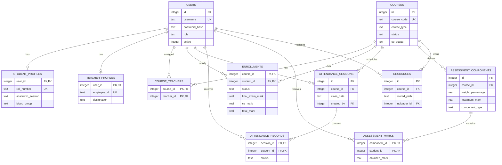
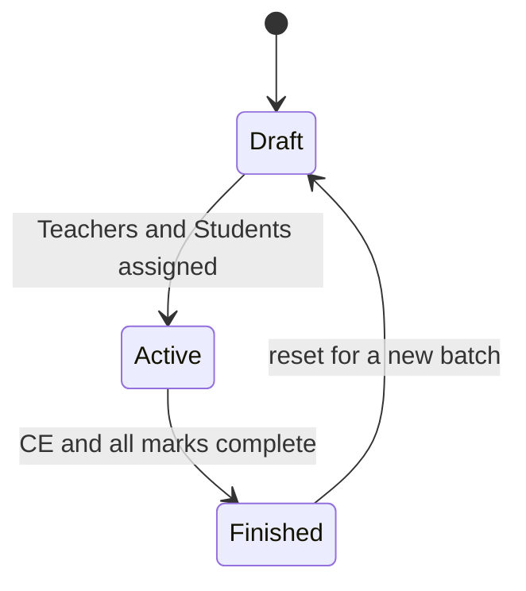
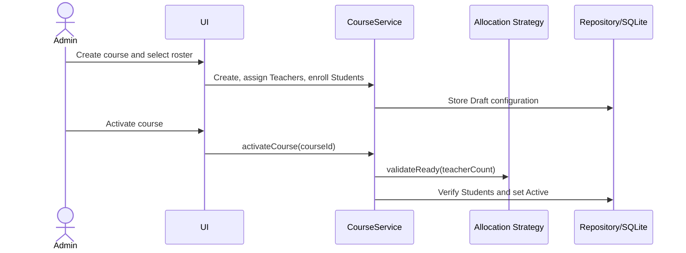
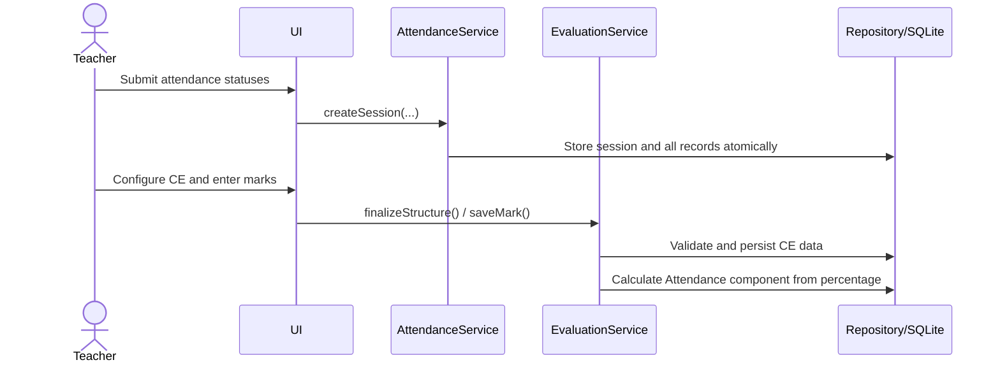
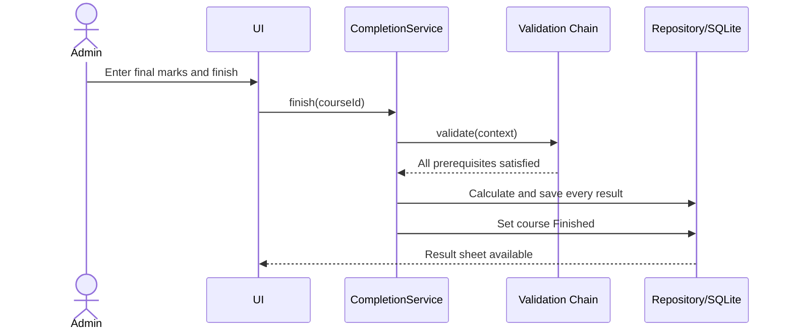
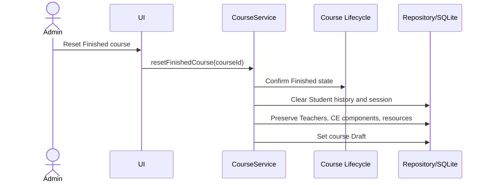
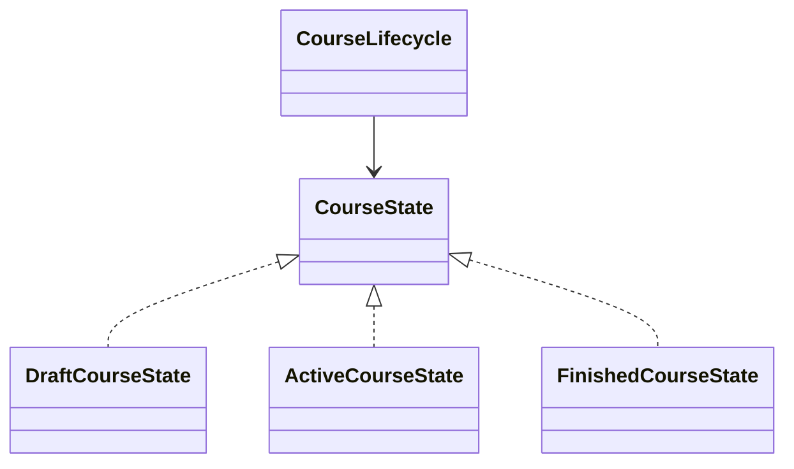
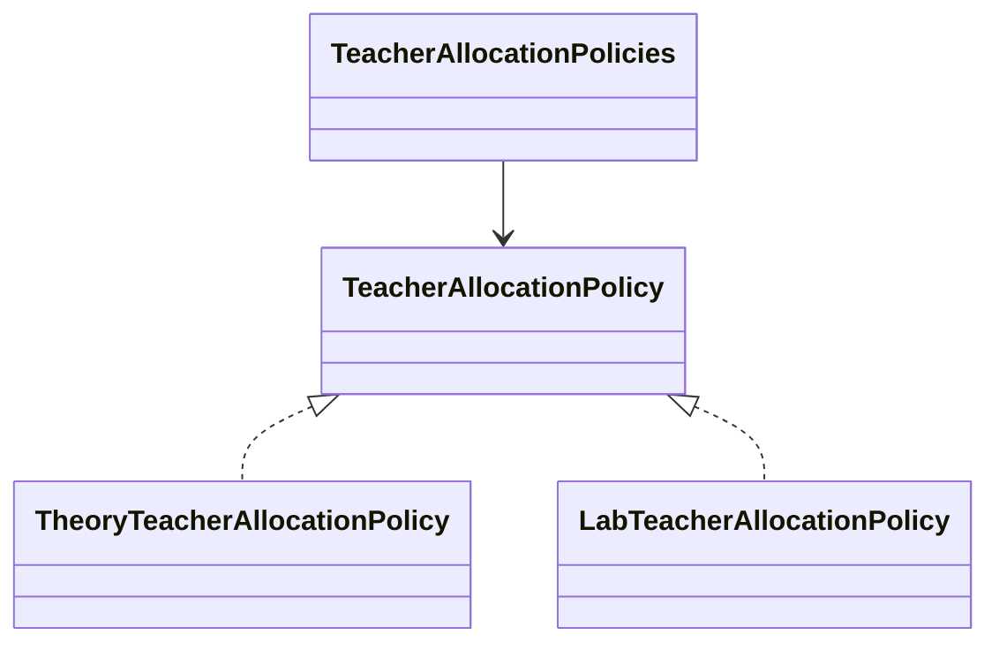
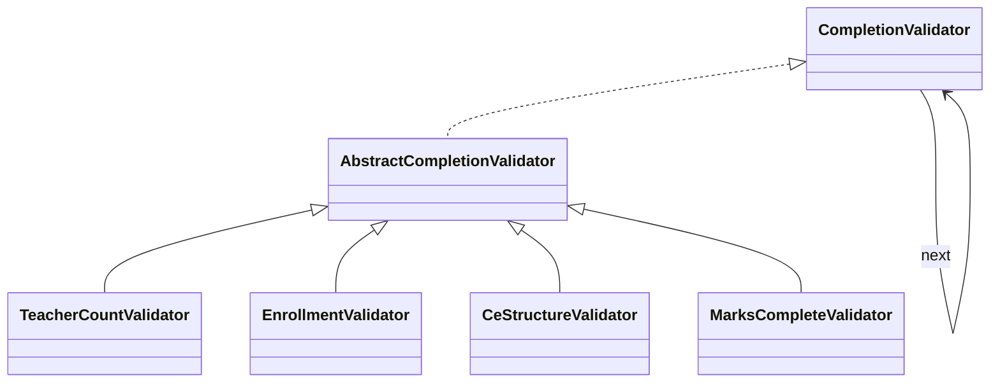
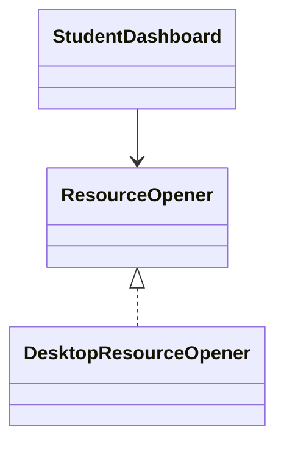

# Technical Documentation

## Project Information

| Item | Details |
|---|---|
| Project | IIT Management System (IITMS) |
| Academic project | MiniSPL2 |
| Course | Design Pattern (SE 2215) |
| Team | MD. Azizul Hakim (1634)  -  Sadman Sakib (1654) |
| Repository | [Ashik590/IIT-Management-System](https://github.com/Ashik590/IIT-Management-System) |

## 1. Brief Description

The project is a full-screen JavaFX desktop system for the academic lifecycle of IIT courses. It supports role-based account access, Student and Teacher directories, Draft course setup, Teacher allocation, Student enrollment, attendance, weighted Continuous Evaluation (CE), learning resources, final results, course completion, and reuse of a Finished course for a new batch. SQLite provides persistent storage and Maven manages building, dependencies, execution, and tests.

The system is workflow-oriented rather than a collection of CRUD forms. Course activation, academic delivery, completion, and reset contain state-dependent rules and coordinated database operations.

## 2. Technology and Architecture

| Technology | Use |
|---|---|
| Java 21 | Application language |
| JavaFX 21 | Desktop presentation layer |
| Maven | Build and dependency management |
| SQLite + Xerial JDBC | Persistent relational storage |
| JUnit 5 | Unit and integration testing |
| SHA-256 with salt | Password hashing |

```text
JavaFX UI -> Services/business rules -> Repositories/JDBC -> SQLite
                         |
                  Design patterns
```

- **UI:** role-specific screens and input handling.
- **Services:** authorization, validation, transactions, calculations, and workflows.
- **Repositories:** SQL and domain-object mapping.
- **Domain:** business records and enums.
- **Patterns:** lifecycle, allocation, validation, and platform integration abstractions.

## 3. Source Structure

```text
IIT-Management-System/
├── pom.xml
├── README.md
├── PROJECT_SPECIFICATION.md
├── TECHNICAL_DOCUMENTATION.md
├── src/
│   ├── main/
│   │   ├── java/edu/du/iit/cms/
│   │   │   ├── db/           # connection, migration, seeding
│   │   │   ├── domain/       # records and enums
│   │   │   ├── pattern/      # adapter, chain, state, strategy
│   │   │   ├── repository/   # JDBC persistence
│   │   │   ├── security/     # password hashing
│   │   │   ├── service/      # use cases and business rules
│   │   │   └── ui/           # JavaFX views
│   │   └── resources/        # schema.sql and CSS
│   └── test/java/             # unit and integration tests
└── data/                      # generated database and resources
```

`AppServices` assembles repository and service dependencies. `IitCourseManagementApp` initializes the database, seeds initial records, and opens the login view.

## 4. Database Design

The schema has ten related tables with foreign keys, checks, unique keys, composite keys, and lookup indexes. SQLite foreign-key enforcement is enabled for every connection.



- Composite primary keys prevent duplicate allocations, enrollments, attendance rows, and assessment marks.
- `CHECK` constraints restrict roles, states, attendance values, weights, and numeric ranges.
- Cascades remove dependent course-owned data; restricted user references protect academic history.
- Service transactions make account creation, attendance submission, completion, and reset atomic.
- `DatabaseSeeder` loads representative data only when the users table is empty.

## 5. Principal Workflows



- **Draft:** Administrator edits the course and allocations. Other roles cannot see it.
- **Active:** assigned Teachers perform academic work and enrolled Students view records.
- **Finished:** academic records are read-only and final results are available.
- **Reset:** session and Student-specific records are cleared while reusable configuration remains.

Completion proceeds as follows:

1. Administrator enters course-type-specific final marks.
2. Validators check Teacher count, enrollment, CE structure, and mark completeness.
3. CE and total marks are calculated for every Student.
4. Enrollment outcomes and Finished status are committed in one transaction.

Theory uses CE 40 + final 60; Lab uses CE 70 + final 30. Attendance is a protected CE component, defaults to 15%, and derives its mark from attendance percentage.

### Course setup and activation sequence



### Attendance and CE sequence



### Completion sequence



### New-batch reset sequence



## 6. Design Patterns

### State - course lifecycle

**Problem:** allowed operations differ between Draft, Active, and Finished courses.

**Implementation:** `CourseState` is implemented by `DraftCourseState`, `ActiveCourseState`, and `FinishedCourseState`; `CourseLifecycle` selects the current behavior.

**Reason and benefit:** behavior genuinely varies by state. Permissions remain centralized, and future states can be added without spreading status conditionals through services.



### Strategy - Teacher allocation

**Problem:** Theory requires one Teacher and Lab requires two; the rule is reused during allocation, activation, and completion.

**Implementation:** `TeacherAllocationPolicy` has `TheoryTeacherAllocationPolicy` and `LabTeacherAllocationPolicy` implementations, selected by `TeacherAllocationPolicies`.

**Reason and benefit:** the varying rule is an interchangeable algorithm. A new course type can add a policy without rewriting workflows. Distributed `if/else` rules were rejected.



### Chain of Responsibility - completion validation

**Problem:** completion has several ordered prerequisites and should report the first actionable failure.

**Implementation:** `CompletionValidator` handlers check Teacher count, enrollment, CE structure, and marks through `CompletionValidationChain`.

**Reason and benefit:** checks can be added, reordered, and tested independently. A large validation method was rejected. The chain acts as an all-must-pass validation pipeline.



### Adapter - desktop resource opening

**Problem:** `java.awt.Desktop` is platform-specific and should not be coupled to JavaFX screens.

**Implementation:** `ResourceOpener` is the application interface; `DesktopResourceOpener` adapts the desktop API. `StudentDashboard` uses only the interface.

**Reason and benefit:** operating-system integration is isolated, replaceable, and testable without opening real applications. Direct calls from the UI were rejected.



```text
State authorizes lifecycle operation
  -> Strategy supplies Teacher rule
  -> Chain validates completion
  -> Service commits changes

Adapter independently isolates operating-system file opening.
```

Singleton, Observer, Command, and Abstract Factory are not claimed because current requirements do not justify them.

## 7. Validation, Security, and Reliability

- Passwords are salted and hashed; plain-text passwords are not persisted.
- Role, ownership, and lifecycle checks occur in services, not only in UI controls.
- Prepared statements handle user-provided database values.
- File uploads enforce type and 20 MB size limits and use generated names.
- Transactions roll back failed multi-step changes.
- Validation errors are displayed through consistent JavaFX alerts.

The current salted SHA-256 password scheme is acceptable for this academic prototype but should be replaced by Argon2id, bcrypt, or PBKDF2 in production.

## 8. Testing

```bash
mvn clean test
```

| Test area | Coverage |
|---|---|
| Integration | authentication, filtered search, courses, attendance, CE, completion, reset, persistence |
| State | lifecycle permissions and transitions |
| Strategy | Theory/Lab Teacher rules |
| Chain | ordered validation and failures |
| Adapter | resource-opening validation and abstraction |

The suite emphasizes business behavior rather than JavaFX rendering. Temporary databases isolate integration tests, while pattern tests exercise each abstraction directly. Directory role separation, account activation, attendance-component protection, course-type marks, atomic completion, reset cleanup, and preservation rules are explicitly covered.

Latest verification: **15 tests, 0 failures, 0 errors**.

## 9. Assignment Requirement Mapping

| Assignment expectation | Evidence |
|---|---|
| JavaFX desktop application | Login and role-based full-screen dashboards |
| Maven | Dependencies and plugins in `pom.xml` |
| SQLite and seeders | 10-table schema, repositories, `DatabaseSeeder` |
| At least 4 entities | Users, courses, enrollments, attendance, assessments, resources |
| CRUD for important entities | Accounts, Draft courses, and CE components |
| Multi-step workflows | Activation, attendance, completion, and reset |
| Search/analysis/reporting | Two directories, attendance/CE calculations, result sheet |
| Approximately 4-8 screens | Login, three dashboards, Students directory, Teachers directory |
| Meaningful patterns | State, Strategy, Chain of Responsibility, Adapter |
| UML and ER diagrams | Pattern class diagram, lifecycle diagram, and ER diagram above |
| Tests and validation | JUnit unit/integration suite and layered validation |
| Git collaboration | Feature branches, merges/pull requests, and contributor history |

## 10. Limitations and Extension Points

- Local SQLite and files target one desktop installation, not concurrent network users.
- Password reset, audit history, notifications, and backup interfaces are not implemented.
- Allocation strategies can support new course types.
- Completion handlers can support additional academic rules.
- Course states can support approval or archive stages.
- Another resource-opening adapter can support a different platform or storage service.
