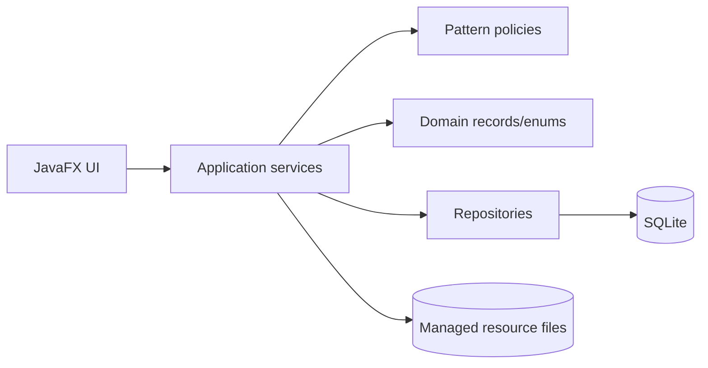
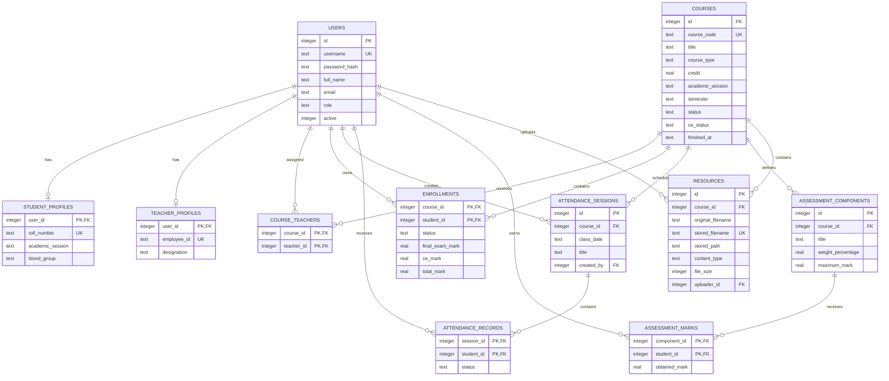
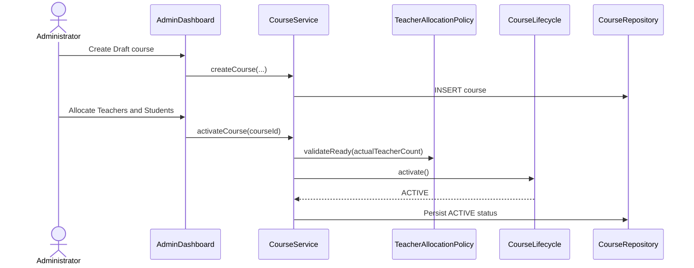
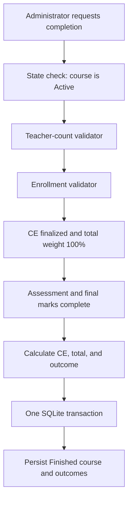
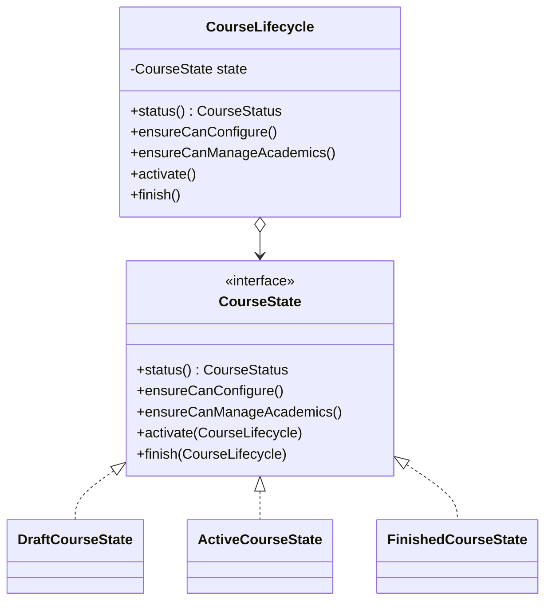
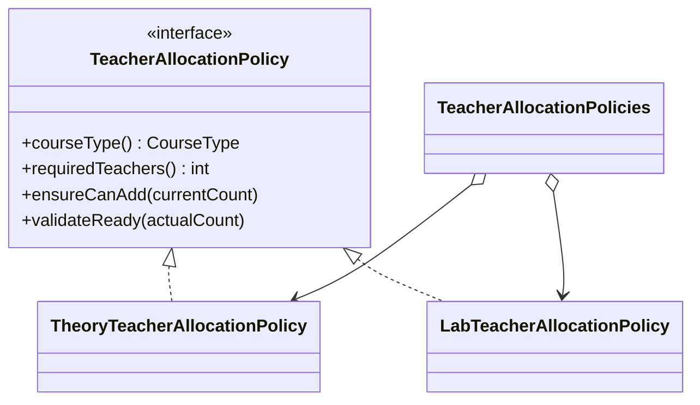
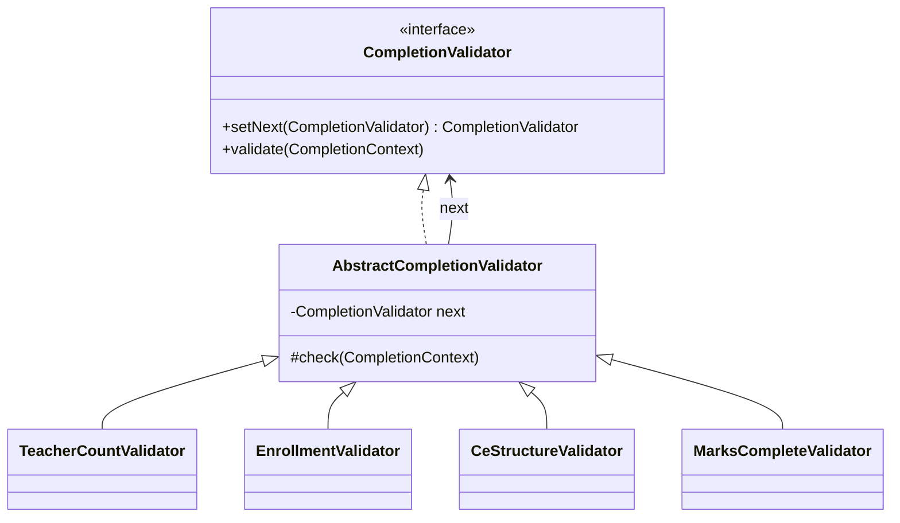

# IIT Course Management System

## Technical Documentation

**Repository:** [github.com/Ashik590/IIT-Management-System](https://github.com/Ashik590/IIT-Management-System)  
**Application type:** JavaFX desktop application  
**Persistence:** SQLite through JDBC  
**Build system:** Maven  
**Java version:** 21  
**Documentation status:** Submission-ready technical reference

This document describes the implemented system, its scope, architecture, database model, business workflows, design-pattern decisions, validation rules, testing strategy, and operating instructions. The public [README.md](README.md) provides a shorter repository-oriented overview; this document is the detailed technical submission document.

## 1. Executive summary

The IIT Course Management System manages a course from initial configuration to final academic completion. It provides separate role-based experiences for Administrators, Teachers, and Students.

The application supports:

- account creation, authentication, activation, deactivation, and user search;
- course creation, Draft editing, Teacher allocation, Student enrollment, and activation;
- attendance session creation and attendance percentage calculation;
- configurable Continuous Evaluation (CE) components and weighted CE calculation;
- assessment mark entry and correction;
- managed course-resource upload and authorized access;
- final-exam marks out of 60;
- atomic course completion with Completed/Incomplete outcomes; and
- read-only access to historical Finished courses.

The design intentionally focuses on a single coherent academic workflow. It does not include ratings, anonymous reports, alumni management, messaging, fees, payroll, room scheduling, online examination delivery, or student resource uploads.

## 2. Problem statement

Academic course management contains rules that simple forms do not solve safely:

1. A Draft course can be configured, while an Active course can record academic work.
2. A Finished course must preserve history and reject all academic mutation.
3. Theory and Lab courses require different numbers of Teachers.
4. A CE structure must total exactly 100% before marks can be entered.
5. A course cannot finish while any required mark is missing.
6. Final results require CE marks out of 40 and final-exam marks out of 60.
7. Several database changes must succeed together or be rolled back together.

These changing behaviors are the reason the implementation uses State, Strategy, and Chain of Responsibility rather than placing all rules in controllers or SQL forms.

## 3. Objectives and scope

### 3.1 Objectives

- Provide a usable JavaFX desktop workflow for three roles.
- Store academic data persistently in SQLite.
- Enforce important rules in the service/domain layer and again where appropriate with database constraints.
- Keep the JavaFX layer separate from persistence and business policy.
- Demonstrate design patterns because they solve real variations in the domain.
- Make the implementation testable without starting the JavaFX window.

### 3.2 In-scope entities

The implemented schema contains 11 tables:

| Entity/table | Purpose |
|---|---|
| `users` | Login identity, role, contact data, and active state |
| `student_profiles` | Student roll number, session, and blood group |
| `teacher_profiles` | Teacher employee ID and designation |
| `courses` | Course metadata, lifecycle status, and CE status |
| `course_teachers` | Many-to-many Teacher allocation relationship |
| `enrollments` | Student-course relationship, final marks, and outcome |
| `attendance_sessions` | Class date, title, course, and creating Teacher |
| `attendance_records` | Present/Absent value per session and Student |
| `assessment_components` | CE component title, weight, and maximum mark |
| `assessment_marks` | Obtained mark per component and Student |
| `resources` | Uploaded-file metadata and managed storage path |

### 3.3 Explicit non-goals

The following are intentionally excluded so the core workflow remains manageable:

- Teacher ratings and feedback;
- anonymous Student reports;
- alumni records;
- notifications, messaging, and email;
- student-uploaded resources;
- fees, payroll, and room scheduling;
- online classes and examination delivery; and
- mid-course Teacher reassignment.

## 4. Actors and permissions

### Administrator

The Administrator manages system setup and course completion:

- create Student and Teacher accounts;
- search accounts using supported profile fields;
- activate or deactivate accounts;
- create, edit, and delete Draft courses;
- assign or remove Teachers while a course is Draft;
- enroll or remove Students while a course is Draft;
- activate a course after allocation requirements pass;
- enter final-exam marks from 0 to 60;
- request course completion; and
- view course rosters and result sheets.

### Teacher

A Teacher can access only assigned courses:

- view assigned Active and Finished courses;
- create attendance sessions for an Active course;
- add, update, and delete CE components;
- finalize a CE structure whose weights equal 100%;
- enter or update assessment marks within each component's maximum;
- upload supported resources up to 20 MB; and
- view Student academic summaries.

### Student

A Student can access only enrolled courses:

- view current and Finished courses;
- view attendance history and percentage;
- view components, entered marks, and provisional/current CE;
- view final CE, final-exam mark, total, and outcome after completion; and
- view and open authorized course resources.

## 5. Functional requirements

### Authentication and authorization

- Login requires a valid username and password.
- Inactive users cannot log in.
- The dashboard is selected from the authenticated user's role.
- Services verify assignment or enrollment before returning protected course data.
- A Finished course is read-only through lifecycle checks.

### Course management

Each course stores a unique code, title, type, credit, session, semester, lifecycle status, and CE status.

Course lifecycle:

```text
Draft -> Active -> Finished
```

Activation requires:

- exactly one assigned Teacher for Theory;
- exactly two assigned Teachers for Lab; and
- at least one enrolled Student.

Draft course metadata and Draft allocations can be corrected. After activation, the allocation is locked.

### Attendance

When a Teacher creates a session, all enrolled Students must be included exactly once. The UI initially marks every Student Present; the Teacher changes absent Students before submission.

```text
attendance percentage = present sessions / total submitted sessions × 100
```

No attendance sessions are represented as unavailable/unknown rather than a misleading percentage.

### Continuous Evaluation

The CE total is 40 marks. Each component contains:

- title;
- weight percentage; and
- maximum mark.

The component weights must total exactly 100% before the structure can be finalized. Changing a component weight or deleting a component returns the CE structure to Draft while preserving unrelated marks.

For each component:

```text
contribution = (obtained mark / maximum mark)
                × (weight percentage / 100)
                × 40
```

The Student's CE mark is the sum of all contributions.

### Final examination and completion

The final examination is worth 60 marks. The final result is calculated as:

```text
total mark = CE mark out of 40 + final-exam mark out of 60

total mark >= 40 -> COMPLETED
total mark < 40  -> INCOMPLETE
```

Before completion, the system verifies course state, Teacher count, enrollment, CE finalization, CE total weight, every assessment mark, and every final-exam mark.

## 6. Non-functional requirements

| Requirement | Implementation |
|---|---|
| Persistence | SQLite database under the configured data directory |
| Maintainability | Layered packages and explicit service/repository boundaries |
| Testability | Manual dependency wiring and temporary SQLite directories in tests |
| Data integrity | Foreign keys, unique constraints, checks, indexes, and transactions |
| Security baseline | Salted PBKDF2 password hashes; parameterized SQL |
| Usability | Role-specific dashboards, validation messages, and seeded demo data |
| Portability | Maven-managed JavaFX/JDBC dependencies and configurable data path |

## 7. Technology and project structure

### 7.1 Technology stack

| Technology | Version | Use |
|---|---:|---|
| Java | 21 | Application code |
| JavaFX Controls | 21 | Desktop interface |
| Maven | 3.9+ recommended | Build and dependency management |
| Xerial SQLite JDBC | 3.53.4.0 | JDBC driver |
| SQLite | Embedded | Persistent relational storage |
| JUnit Jupiter | 5.12.2 | Automated tests |

### 7.2 Source tree

```text
IIT-Management-System/
├── pom.xml
├── README.md
├── TECHNICAL_DOCUMENTATION.md
├── 01 - Refined User Story.md
├── data/
│   └── resources/.gitkeep
└── src/
    ├── main/
    │   ├── java/edu/du/iit/cms/
    │   │   ├── db/             # Schema setup and seed data
    │   │   ├── domain/         # Records and enums
    │   │   ├── pattern/        # State, Strategy, Chain of Responsibility
    │   │   ├── repository/     # Parameterized SQL and row mapping
    │   │   ├── security/       # Password hashing
    │   │   ├── service/        # Use cases and business rules
    │   │   └── ui/             # JavaFX views and dashboards
    │   └── resources/
    │       ├── db/schema.sql
    │       └── style.css
    └── test/java/edu/du/iit/cms/
```

### 7.3 Layer responsibilities



| Layer/package | Responsibility |
|---|---|
| `ui` | Display screens, collect input, invoke services, and show feedback |
| `service` | Coordinate use cases, authorization, validation, calculations, and transactions |
| `pattern` | Encapsulate lifecycle behavior, allocation policies, and completion validation |
| `domain` | Immutable records and constrained enumerations |
| `repository` | SQL statements, transactions, and database-to-domain mapping |
| `db` | Connection setup, schema execution, and seed data |
| `security` | Password hashing and constant-time comparison |

`AppServices` is the composition root. It constructs the database, repositories, pattern objects, and services with explicit dependencies. It is not used as a global Singleton.

## 8. Database design

The schema is defined in `src/main/resources/db/schema.sql` and initialized idempotently on application startup. It uses eleven relational tables, foreign keys, uniqueness constraints, domain checks, indexes, and controlled cascade behavior.

### 8.1 Entity relationships



### 8.2 Integrity controls

- `users.username`, profile identifiers, `courses.course_code`, and `resources.stored_filename` are unique.
- Composite primary keys prevent duplicate Teacher assignments, enrollments, attendance rows, and component marks.
- Foreign keys are enabled on every SQLite connection with `PRAGMA foreign_keys = ON`.
- Child records cascade where the parent is their only meaningful owner, such as Draft course allocations and assessment marks.
- Historical users are deactivated instead of physically deleted so old academic records retain their owner.
- Database `CHECK` constraints restrict role values, lifecycle states, attendance states, score ranges, and active flags.
- All user-provided SQL values use `PreparedStatement` parameters.

### 8.3 Transaction boundaries

| Operation | Atomicity guarantee |
|---|---|
| Student/Teacher creation | Base user and role profile are created together |
| Attendance submission | Session and all Student records are stored together |
| CE component mutation | Component change and CE reset to Draft are stored together |
| Course completion | Enrollment results and Finished state commit together |
| Database seeding | Demonstration records are inserted as one dataset |

## 9. Application workflows

### 9.1 Course setup and activation



The Administrator can edit a Draft course and correct allocations. Activation is rejected when the required Teacher count or roster condition is not satisfied.

### 9.2 CE setup and mark entry

1. An assigned Teacher selects an Active course.
2. The Teacher creates CE components.
3. The Teacher adjusts weights until the total is exactly 100%.
4. The Teacher finalizes the CE structure.
5. The Teacher enters marks within each component's maximum.
6. A mark is upserted, so correction does not create duplicate rows.
7. A component change returns CE to Draft and blocks further mark entry until finalization again.

### 9.3 Attendance submission

1. The Teacher selects an assigned Active course.
2. The service verifies the date is not in the future.
3. The service verifies that the attendance map contains every enrolled Student exactly once.
4. The repository inserts one attendance session and all attendance records in a transaction.
5. Reporting queries calculate totals and percentages from persisted records.

### 9.4 Completion and result generation



The operation fails fast at the first invalid prerequisite. If persistence fails after calculation, the transaction rolls back.

## 10. Design-pattern implementation

### 10.1 Pattern categories

The Gang of Four patterns are grouped by the kind of design pressure they address:

| Category | Concern | Examples | Project decision |
|---|---|---|---|
| Creational | Object construction | Factory, Builder, Prototype, Singleton | No GoF creational pattern is needed; construction is simple and explicit in `AppServices`. |
| Structural | Class/object composition | Adapter, Decorator, Composite, Proxy | No GoF structural pattern is needed; layering already separates responsibilities. |
| Behavioral | Collaboration and varying behavior | State, Strategy, Chain of Responsibility | State, Strategy, and Chain of Responsibility are used. |

Patterns are not added merely to increase the pattern count. Each selected pattern corresponds to a real variation in the requirements.

### 10.2 State pattern

**Problem:** the allowed operations differ between Draft, Active, and Finished courses.

**Implementation:**

- Context: `CourseLifecycle`
- State interface: `CourseState`
- Concrete states: `DraftCourseState`, `ActiveCourseState`, `FinishedCourseState`
- Clients: `CourseService`, academic services, and `CourseCompletionService`



Behavior:

| State | Configure | Academic mutation | Activate | Finish |
|---|:---:|:---:|:---:|:---:|
| Draft | Yes | No | Yes | No |
| Active | No | Yes | No | Yes |
| Finished | No | No | No | No |

**Why selected:** otherwise every service operation would repeat status `if`/`switch` logic. The State pattern centralizes lifecycle behavior and makes a future `ARCHIVED` or `REVIEW` state local to its own class.

**Alternative:** an enum with repeated switches would use fewer classes but would duplicate policy across services and make new states harder to audit.

### 10.3 Strategy pattern

**Problem:** the required Teacher count differs by course type and is used during allocation, activation, and completion.

**Implementation:**

- Strategy interface: `TeacherAllocationPolicy`
- Concrete strategies: `TheoryTeacherAllocationPolicy`, `LabTeacherAllocationPolicy`
- Selector: `TeacherAllocationPolicies`
- Clients: `CourseService`, `CourseCompletionService`



**Why selected:** it gives each allocation algorithm one home and provides a stable extension point for Project, Thesis, or team-taught courses.

**Alternative:** a direct conditional such as `type == THEORY ? 1 : 2` is shorter but would be duplicated when the rule is needed in more workflows.

### 10.4 Chain of Responsibility pattern

**Problem:** course completion requires several independent checks in a meaningful order.

**Implementation chain:**

```text
TeacherCountValidator
    -> EnrollmentValidator
        -> CeStructureValidator
            -> MarksCompleteValidator
                -> result calculation and transaction
```



Each handler has one responsibility:

- `TeacherCountValidator` checks the Strategy-provided required count.
- `EnrollmentValidator` rejects an empty roster.
- `CeStructureValidator` checks finalized CE and 100% weight.
- `MarksCompleteValidator` checks all assessment and final-exam marks.

**Why selected:** validators can be tested independently, the order is explicit, and future checks can be inserted without expanding one large completion method.

**Alternative:** a single validation method or a list of anonymous predicates would reduce files but weaken rule-specific errors, extension, and test isolation.

### 10.5 Pattern cooperation

The completion use case demonstrates how the patterns work together:

1. State verifies that the course is Active.
2. Strategy provides the correct Teacher-count requirement.
3. The Chain of Responsibility validates all completion prerequisites.
4. The service calculates results.
5. The repository commits enrollment outcomes and Finished status atomically.

### 10.6 Patterns intentionally not claimed

- **Singleton:** would hide dependencies and make isolated tests harder.
- **Factory Method/Abstract Factory:** there is no complex object family or construction variation.
- **Observer:** there are no asynchronous domain subscribers; explicit JavaFX refreshes are sufficient.
- **Facade:** `AppServices` wires objects; it does not claim to be a separate GoF Facade.
- **Command:** undo, queueing, macros, and durable commands are not requirements.

## 11. Service and persistence design

### 11.1 Services

| Service | Main responsibility |
|---|---|
| `AuthService` | Authenticate active users and return a safe `User` record |
| `UserService` | Validate and create role-specific accounts, search, and change active state |
| `CourseService` | Course CRUD, allocation, enrollment, activation, and final-exam marks |
| `AttendanceService` | Authorization, date/roster validation, and attendance submission |
| `EvaluationService` | CE components, finalization, mark validation, and CE calculation access |
| `ResourceService` | File validation, managed copying, metadata persistence, and authorization |
| `ReportingService` | Attendance, CE, enrollment, and result-sheet summaries |
| `CourseCompletionService` | Completion context, final calculation, and completion transaction |

### 11.2 Repositories

Repositories do not contain JavaFX code. They open short-lived SQLite connections, bind SQL parameters, map rows to immutable domain records, and own multi-statement transaction boundaries. Services remain responsible for business authorization and domain validation.

### 11.3 Resource storage

Uploaded files are copied into the configured `data/resources` directory using a UUID-based stored filename. SQLite stores original filename, stored path, MIME type, size, course, and uploader. The service rejects unsupported extensions, files larger than 20 MB, missing files, and paths outside the managed directory.

## 12. Security and validation

### Password security

Passwords are stored using `PBKDF2WithHmacSHA256` with:

- a random 16-byte salt;
- 120,000 iterations;
- a 256-bit derived key; and
- constant-time comparison during verification.

The stored format is `iterations:salt:derivedHash`, with salt and hash encoded using Base64.

### Validation matrix

| Input/rule | Enforcement |
|---|---|
| Blank required text | Service validation |
| Username spaces | Service validation |
| Email format | Service regular expression |
| Password minimum length | Password hashing service |
| Duplicate identifiers | SQLite unique constraints |
| Theory/Lab Teacher count | Strategy and service validation |
| Duplicate allocations | Composite primary keys and service checks |
| Credit range | Service and database check |
| Final mark range | Service and database check |
| CE weight range/total | Evaluation service and completion chain |
| Assessment mark range | Evaluation service and database check |
| Unauthorized course access | Service ownership/enrollment checks |
| Finished-course mutation | State pattern |
| Future attendance date | Attendance service |
| Missing completion marks | Chain validator |
| File size/type/path | Resource service |

## 13. Error handling and consistency

Expected domain errors are reported through `ValidationException` and displayed by the JavaFX UI. Persistence failures are wrapped with an operation-specific message while retaining the original exception as the cause.

Important multi-step operations use transactions:

- role-account creation;
- attendance submission;
- CE component mutation;
- database seeding; and
- course completion.

Course completion validates before opening its write transaction, calculates every result, then updates all enrollments and the course status together. A failure rolls back the entire completion operation.

## 14. Testing

Run the complete suite:

```powershell
mvn clean test
```

### Test coverage

| Test class | Coverage |
|---|---|
| `CourseLifecycleTest` | Draft/Active/Finished transitions and mutation rejection |
| `TeacherAllocationPolicyTest` | Theory/Lab counts and over-allocation rules |
| `CompletionValidationChainTest` | Validator order and failure behavior |
| `AppServicesIntegrationTest` | SQLite schema, seeding, authentication, CE, attendance, completion outcomes, safe CRUD, and CE reset |

The integration tests use JUnit temporary directories, so they do not modify a developer's normal `data` directory.

### Verification result

```text
Tests run: 9, Failures: 0, Errors: 0, Skipped: 0
BUILD SUCCESS
```

The JavaFX entry point has also been started successfully with `mvn javafx:run` during smoke verification.

## 15. Installation and operation

### Prerequisites

- JDK 21 or compatible Java 21 distribution;
- Maven 3.9 or newer recommended; and
- an operating system with JavaFX desktop support.

### Build and run

```powershell
git clone <repository-url>
cd IIT-Management-System
mvn clean test
mvn javafx:run
```

The application initializes the database at `data/iit-course-management.db` and managed files at `data/resources`. A custom data directory can be supplied without changing source code:

```powershell
mvn javafx:run -Dcms.data.dir="path\to\application-data"
```

### Seed accounts

When the database is empty, the seed process creates these demonstration accounts:

| Role | Username | Password |
|---|---|---|
| Administrator | `admin` | `admin123` |
| Teacher | `teacher1` | `teacher123` |
| Teacher | `teacher2` | `teacher123` |
| Student | `student1` | `student123` |
| Student | `student2` | `student123` |
| Student | `student3` | `student123` |

These credentials are for local demonstration only and must not be used for a production deployment.

## 16. Demonstration checklist

1. Log in as Administrator and search users.
2. Deactivate an account and demonstrate that it cannot log in.
3. Open the Draft Lab course and show that two Teachers are required.
4. Remove one Teacher and attempt activation to show Strategy validation.
5. Restore the Teacher and activate the course.
6. Log in as an assigned Teacher and submit attendance.
7. Add CE components, alter a weight, and show the return to Draft.
8. Restore a 100% CE total, finalize it, and enter a mark.
9. Upload a supported resource.
10. Log in as a Student and view only enrolled-course data.
11. Enter final-exam marks as Administrator and demonstrate the completion validation chain.
12. Finish the course and show read-only historical results protected by State.

## 17. Known limitations and extension points

The current implementation is intentionally focused. Reasonable future extensions include:

- editing all Student/Teacher profile fields after creation;
- selecting and correcting previously submitted attendance sessions;
- deleting uploaded resources through the UI with coordinated file/metadata removal;
- exporting result sheets to CSV or PDF;
- adding a minimum-attendance validator to the completion chain;
- adding a Result Review or Archived lifecycle state;
- adding Project or Thesis Teacher-allocation strategies; and
- packaging with `jpackage` for machines without Maven.

Any extension should preserve the existing authorization, lifecycle, transaction, and test boundaries.

## 18. Submission checklist

- [ ] Repository URL is accessible.
- [ ] `README.md` provides the public project overview.
- [ ] This technical documentation is included beside the source code.
- [ ] `pom.xml` contains all build dependencies.
- [ ] `schema.sql` and `DatabaseSeeder` are present.
- [ ] JavaFX application starts with `mvn javafx:run`.
- [ ] `mvn clean test` passes.
- [ ] Design patterns are visible under `src/main/java/edu/du/iit/cms/pattern`.
- [ ] ER, workflow, and class diagrams render in GitHub Markdown.
- [ ] Generated database files and uploaded resources are excluded from Git.

## 19. Design summary

The application uses patterns as tools for managing change:

- **State** protects lifecycle-dependent operations.
- **Strategy** isolates course-type allocation rules.
- **Chain of Responsibility** makes completion validation composable.

The remaining architecture—services, repositories, records, transactions, and explicit dependency wiring—supports those patterns without claiming unnecessary GoF patterns. The result is a focused JavaFX/SQLite system that is persistent, testable, and explainable from requirements through implementation.
